# Schritt-für-Schritt: Registrierung und Anmeldung

Diese Seite zeigt anhand von Screenshots, wie die Registrierung und die erste Anmeldung ablaufen.  
Eine Übersicht aller Kontotypen und Anmeldemethoden findest du unter [Konto, Anmeldung & Rollen](Benutzer-Konto).

---

## Registrierung

Es gibt drei Wege zur Registrierung:

| Variante | Wer startet es | Admin-Freigabe | Dauer |
|---|---|---|---|
| **1. Selbst bewerben – Org beitreten** | Neue Person | ✅ erforderlich | Stunden bis Tage |
| **2. Selbst bewerben – Org neu anlegen** | Neue Person | ✅ erforderlich | Stunden bis Tage |
| **3. Einladung durch bestehenden Nutzer** | Bestehendes Mitglied | ❌ nicht nötig | Minuten |

Variante 3 ist der schnellste Weg: ein bestehendes Organisationsmitglied erstellt einen Einladungs-QR-Code, die neue Person scannt ihn und richtet ihr Konto sofort ein — ohne E-Mail-Bestätigung und ohne Admin-Freigabe.

---

### Variante 1: Einer bestehenden Organisation beitreten

#### Schritt 1 — Formular ausfüllen

Öffne die Registrierungsseite und wähle den Tab **„Einer Organisation beitreten"**.

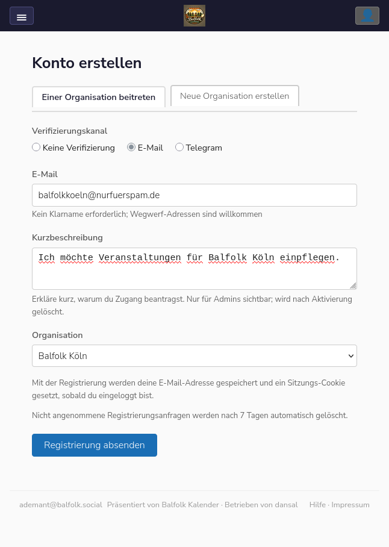

Fülle die Felder aus:

| Feld | Hinweis |
|---|---|
| **Verifizierungskanal** | Wähle **E-Mail** (oder Telegram, falls du keinen E-Mail-Zugang nutzt) |
| **E-Mail** | Kein Klarname erforderlich; Wegwerf-Adressen sind willkommen |
| **Kurzbeschreibung** | Erkläre kurz, warum du Zugang benötigst — nur für Admins sichtbar, wird nach Aktivierung gelöscht |
| **Organisation** | Wähle deine Organisation aus der Liste |

Klicke dann auf **„Registrierung absenden"**.

---

#### Schritt 2 — Bestätigung der Eingabe

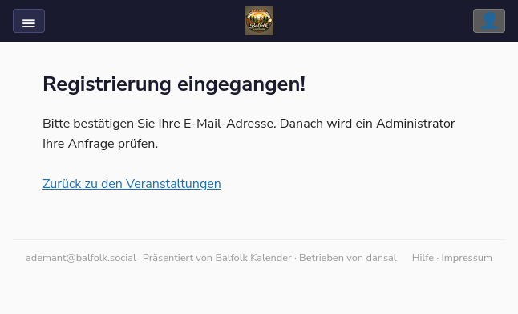

Die Seite bestätigt den Eingang. Du erhältst jetzt eine E-Mail zur Verifizierung deiner Adresse.

---

#### Schritt 3 — E-Mail bestätigen

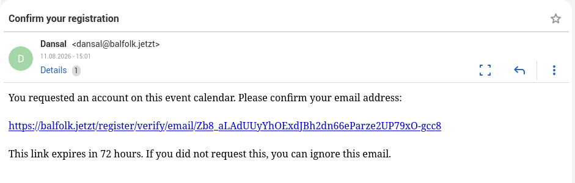

Öffne die E-Mail von Dansal und klicke auf den Bestätigungslink. Der Link ist **72 Stunden** gültig.

---

#### Schritt 4 — Bestätigung abgeschlossen

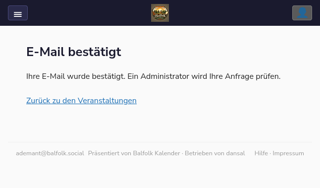

Deine E-Mail-Adresse ist jetzt verifiziert. Ein Administrator wird deine Anfrage prüfen.

---

#### Schritt 5 — Administrator wird benachrichtigt

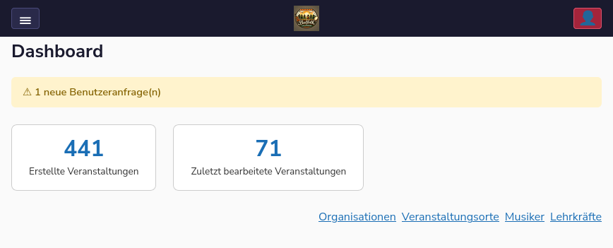

Im Admin-Dashboard erscheint ein Hinweis auf neue Benutzeranfragen.

---

#### Schritt 6 — Administrator prüft die Anfrage

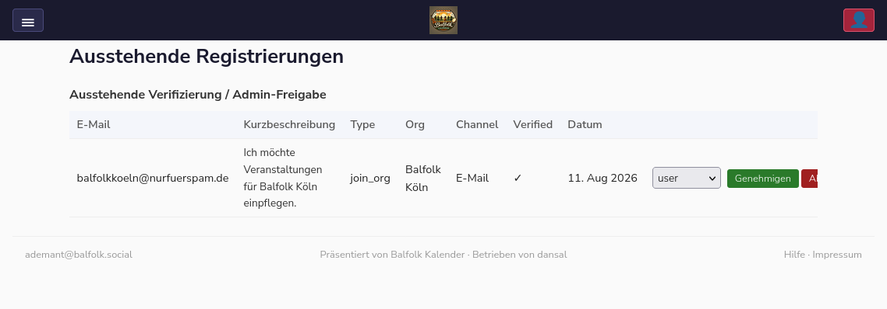

Der Administrator sieht deine Anfrage mit E-Mail-Adresse, Kurzbeschreibung, Organisationswunsch und Verifizierungsstatus. Er kann die Anfrage **genehmigen** oder ablehnen.

---

#### Schritt 7 — Anfrage genehmigt

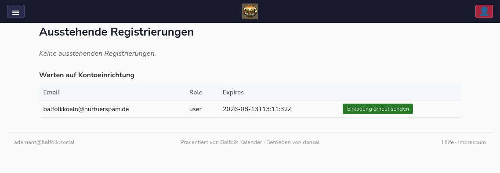

Nach der Genehmigung wechselt der Status auf **„Warten auf Kontoeinrichtung"**. Der Einladungslink ist 48 Stunden gültig; der Admin kann ihn bei Bedarf erneut versenden.

---

#### Schritt 8 — Einladungs-E-Mail

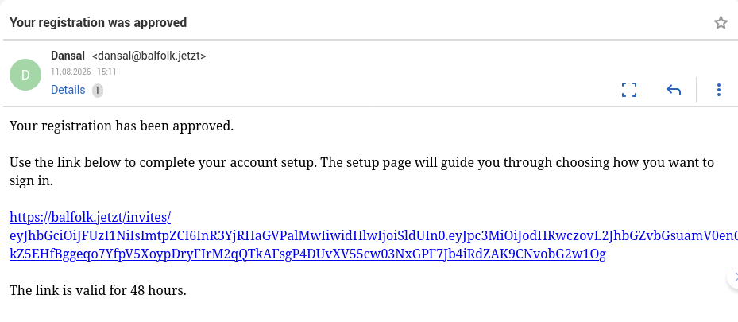

Du erhältst eine E-Mail mit dem Einladungslink zur Kontoeinrichtung. Öffne diesen Link, um fortzufahren.

---

#### Schritt 9 — Konto einrichten: Anmeldemethode wählen

Auf der Einrichtungsseite wählst du, wie du dich künftig anmelden möchtest.

**Option A — Passkey** (empfohlen)

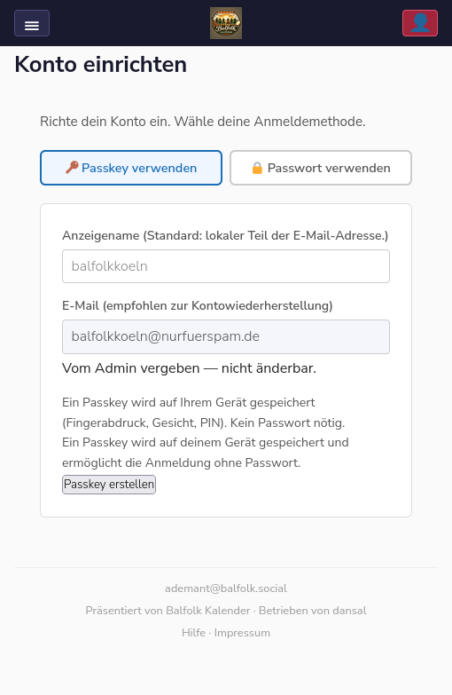

Ein Passkey wird sicher auf deinem Gerät gespeichert (Fingerabdruck, Gesicht, PIN). Kein Passwort nötig. Klicke auf **„Passkey erstellen"** — dein Browser führt dich durch den Vorgang. Der Passkey funktioniert nur mit dem Gerät, auf dem der Passkey erstellt wurde (z.B. Smartphone). Möchtest Du von einem anderen Gerät Dich anmelden, musst Du dort eine eigene Passkey einrichten.

**Option B — Passwort**

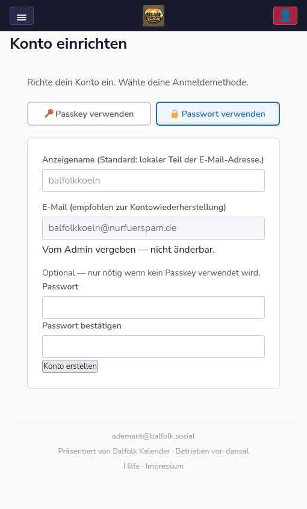

Trage ein Passwort und die Bestätigung ein und klicke auf **„Konto erstellen"**.

> 💡 Du kannst später in den Einstellungen weitere Anmeldemethoden (Passkey, TOTP, Magic Link) hinzufügen.

---

#### Schritt 10 — Passkey im Passwortmanager speichern (optional)

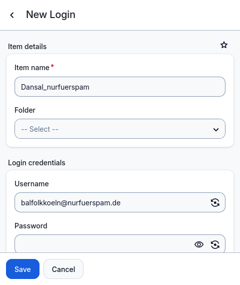

Falls ein Passwortmanager installiert ist, bietet er an, den Eintrag zu speichern. Das ist empfehlenswert, um den Passkey auf mehreren Geräten nutzen zu können.

---

#### Schritt 11 — Erste Anmeldung erfolgreich

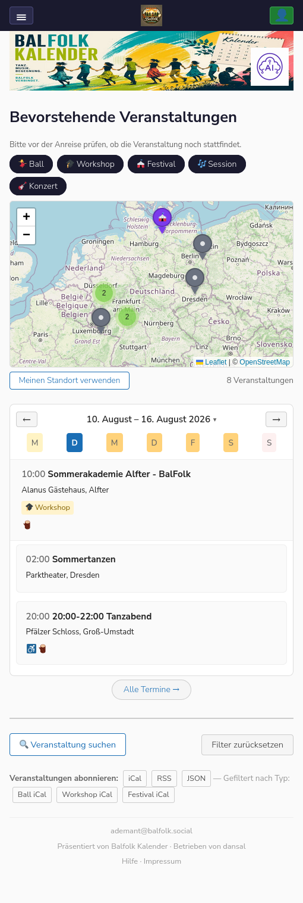

Du landest auf der Kalender-Startseite. Das Benutzer-Symbol oben rechts zeigt, dass du eingeloggt bist.

---

#### Schritt 12 — Profileinstellungen

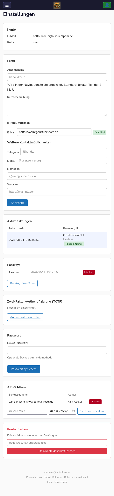

Unter **Einstellungen** (Klick auf dein Avatar-Symbol) kannst du:

- Anzeigenamen und Kurzbeschreibung anpassen
- Telegram, Matrix, Mastodon verknüpfen
- Weitere Passkeys hinzufügen oder löschen
- TOTP (Authenticator-App) einrichten
- Passwort setzen oder ändern
- API-Schlüssel verwalten
- Das Konto dauerhaft löschen

Bis jetzt ist nur Deine E-Mail-Adresse gespeichert. Dies muss keine Adresse sein, welche Du für tägliche Arbeiten verwendest. Es wird davon abgeraten, ein Passwort zu verwenden.

Auf den Profileinstellungen kannst Du einen Nutzernamen festlegen. Nutzername wird aktuell nur verwendet, um anderen angemeldeten Personen zu zeigen, ob Du eine Veranstaltung verändert hast.

---

### Variante 2: Neue Organisation anlegen

#### Schritt 1 — Formular ausfüllen

Wähle den Tab **„Neue Organisation erstellen"**.

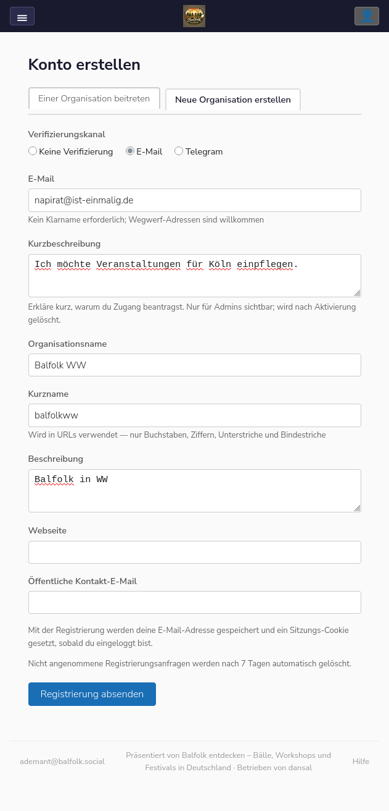

Neben den üblichen Feldern (E-Mail, Kurzbeschreibung) gibst du hier zusätzlich an:

| Feld | Hinweis |
|---|---|
| **Organisationsname** | Vollständiger Name, z. B. „Balfolk WW" |
| **Kurzname** | Wird in URLs verwendet — nur Buchstaben, Ziffern, Unterstriche, Bindestriche |
| **Beschreibung** | Kurze öffentliche Beschreibung der Organisation |
| **Webseite** | Optional |
| **Öffentliche Kontakt-E-Mail** | Optional |

---

#### Schritt 2 — Bestätigung

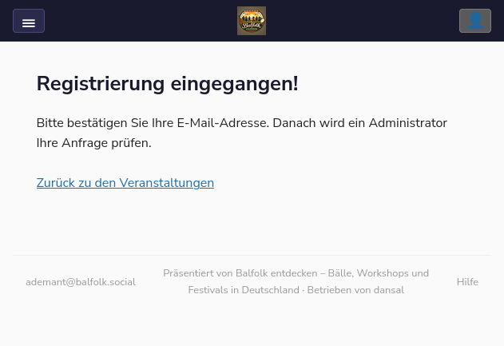

Gleicher Ablauf wie bei Variante 1: E-Mail bestätigen → Admin prüft → Einladungslink → Konto einrichten.

> ℹ️ Die neue Organisation wird erst nach der Admin-Genehmigung im System angelegt.

---

### Variante 3: Einladung durch einen bestehenden Nutzer

Dies ist der schnellste Registrierungsweg. Ein bestehendes Mitglied der Organisation erstellt einen QR-Code, die neue Person scannt ihn und richtet ihr Konto sofort ein — keine E-Mail-Bestätigung, keine Admin-Freigabe, kein Warten.

#### Schritt 1 — Nutzerverwaltung öffnen

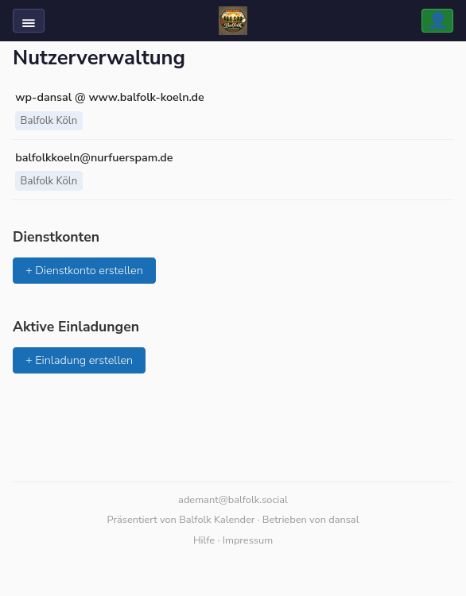

Das einladende Mitglied öffnet die **Nutzerverwaltung** (Klick auf Menu-Symbol oben links → „Nutzerverwaltung"). Die Seite zeigt die Mitglieder der eigenen Organisation sowie den Abschnitt **„Aktive Einladungen"**.

Klicke auf **„+ Einladung erstellen"**.

---

#### Schritt 2 — Organisation auswählen und Einladung erstellen

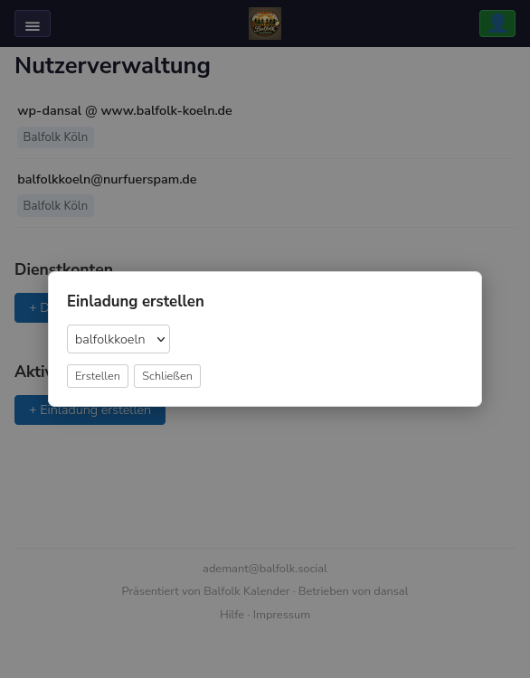

Im Popup wird die eigene Organisation vorausgewählt. Wähle bei Bedarf eine andere Organisation aus dem Dropdown. Klicke dann auf **„Erstellen"**. Es können nur Organisationen ausgewählt werden, die dem Nutzer zugeordnet sind.

---

#### Schritt 3 — QR-Code erscheint

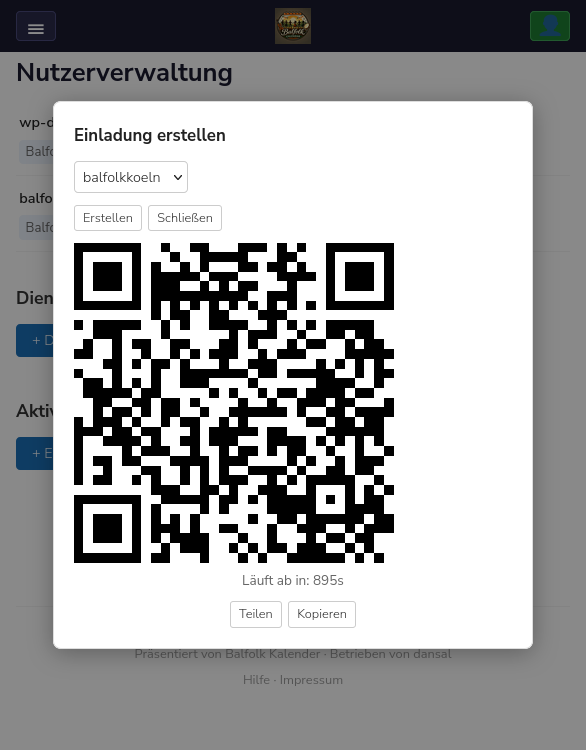

Direkt im Popup erscheint ein QR-Code. Der Code ist ca. **15 Minuten** gültig — der Countdown läuft sichtbar mit.

Zwei Schaltflächen stehen zur Verfügung:

| Schaltfläche | Funktion |
|---|---|
| **Teilen** | Öffnet auf dem Smartphone das native Teilen-Menü (WhatsApp, SMS, AirDrop, …) |
| **Kopieren** | Kopiert den Einladungslink in die Zwischenablage |

Zeige den QR-Code der neuen Person, damit sie ihn mit ihrem Smartphone scannen kann.

Alternativ zum QR-Code kann der Einladungslink per Teilen (Telegram, Signal, E-Mail oder Ähnlichem) dem neuen Nutzer zugesandt werden. Über Kopieren wird der Link in die Zwischenablage kopiert und kann mit einer anderen Anwendung dem neuen Nutzer zur Verfügung gestelt werden.

---

#### Schritt 4 — Neue Person richtet ihr Konto ein

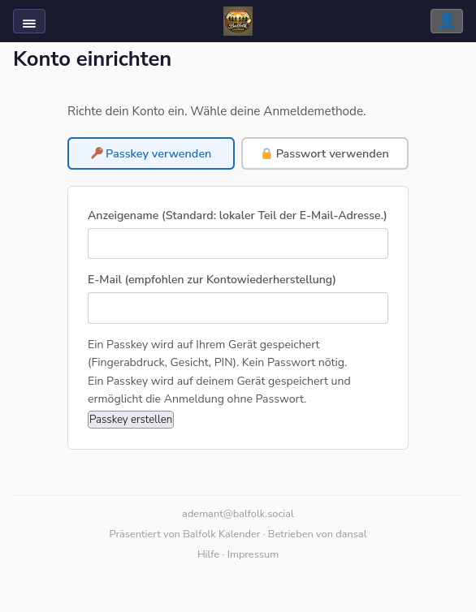

Nach dem Scan (oder Öffnen des Links per Telegram/Signal) öffnet sich auf dem Gerät der neuen Person die Seite **„Konto einrichten"**. Sie wählt ihre bevorzugte Anmeldemethode:

**Option A — Passkey** (empfohlen): Kein Passwort nötig — der Browser speichert einen kryptografischen Schlüssel auf dem Gerät (Fingerabdruck, Gesicht, PIN).

**Option B — Passwort**: Klassische Anmeldung mit Benutzername und Passwort.

Anzeigename und E-Mail sind optional — ein Konto ohne E-Mail-Adresse ist möglich.

> ⏱️ Der QR-Code läuft nach ca. 15 Minuten ab. Danach muss eine neue Einladung erstellt werden. Eine genutzte Einladung kann nicht ein zweites Mal verwendet werden.

> 💡 Möchte die neue Person später einen Passkey auf einem weiteren Gerät einrichten, kann sie in den **Einstellungen** unter „Passkeys" einen neuen Anmeldelink für das zweite Gerät erzeugen.

**WICHTIG** Der neue Nutzer muss weder Anzeigename noch E-Mail-Adresse oder Password eingeben. Einzig über den Passkey erfolgt der Zugriff zu diesem Konto. Diese vollständig anonyme Nutzung birgt allerdings die Gefahr, dass der Zugang zu der Seite verloren geht, wenn das Gerät nicht mehr nutzbar ist (Verloren, defekt etc.). Ein Einladungslink kann erschwert werden, wenn der Admin ohne Name nicht mehr weiß, welches Konto wiederhergestellt werden soll. Es sollte zumindest auf einem zweiten Gerät ein Passkey-Zugang eingerichtet werden.

---

## Anmeldung

### Anmeldeseite

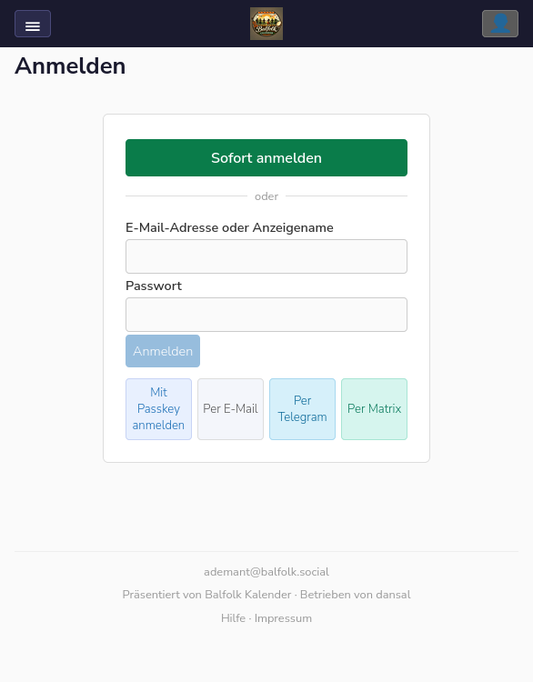

Die Anmeldeseite bietet mehrere Möglichkeiten:

| Schaltfläche | Methode |
|---|---|
| **Sofort anmelden** | Passkey — der Browser fragt nach Fingerabdruck, Gesicht oder PIN |
| **E-Mail + Passwort** | Klassische Anmeldung |
| **Mit Passkey anmelden** | Passkey manuell auswählen |
| **Per E-Mail** | Passwortloser Magic Link per E-Mail |
| **Per Telegram** | Magic Link über Telegram |
| **Per Matrix** | Magic Link über Matrix |

---

### Anmeldung per Magic Link (E-Mail)

Hier die Beschreibung exemplarisch bei Verwendung einer E-Mail-Adresse. Die anderen Methoden (Telegram / Matrix) sind vergleichbar.
#### Schritt 1 — E-Mail eingeben und „Per E-Mail" klicken

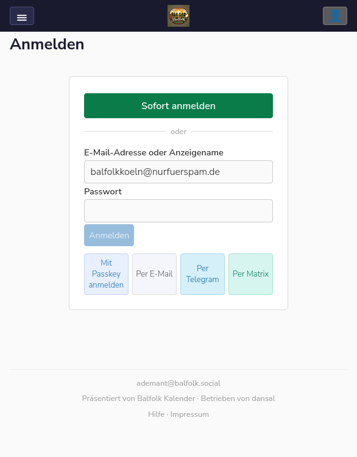

Trage deine E-Mail-Adresse oder deinen Anzeigenamen ein und klicke auf **„Per E-Mail"**.

---

#### Schritt 2 — Bestätigung

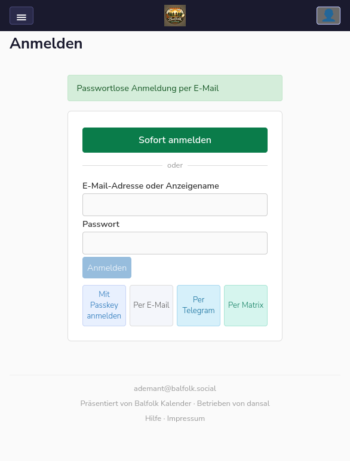

Die Seite bestätigt, dass eine passwortlose Anmeldung per E-Mail unterwegs ist.

---

#### Schritt 3 — Link aus der E-Mail öffnen

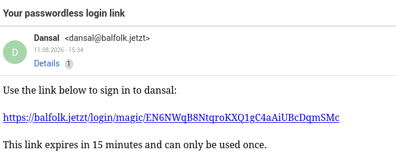

Klicke auf den Link in der E-Mail. Er ist **15 Minuten** gültig und kann nur **einmal** verwendet werden.

---

#### Schritt 4 — Erfolgreich angemeldet

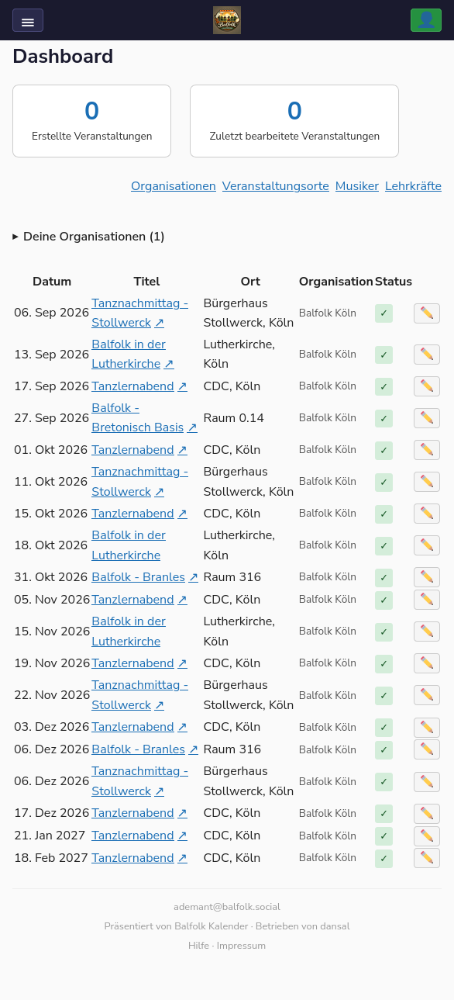

Du landest auf deinem Dashboard mit der Übersicht deiner Veranstaltungen.

---

## Einrichtung Passkey auf weiterem Gerät

Passkey ist eine moderne und sichere Methode, mit der Du mit dem Du nur mit einem ausgewähltem Gerät (z.B. Deinem Smartphone) anmelden kannst. Mit einem zweiten Gerät musst Du eine eigene Passkey einrichten.

### Schritt 1: Anmelden mit Magic link

Auf der Anmeldeseite trage Deine E-Mail-Adresse ein und gehen auf den Punkt "Per E-Mail". Ein Login-Link wird Dir per E-Mail zugesandt. Damit wirst Du angemeldet.

### Schritt 2: Gehe zu Einstellungen

In den Nutzer-Einstellungen ist der Abschnitt **Passkeys**. Dort ist ein Button **Passkey hinzufügen** . Hiermit wird auf dem aktuellen Gerät ein neuer Passkey erzeugt.

### Schritt 3: Zusätzliches Gerät freigeschaltet

Damit ist ein weiteres Gerät freigeschaltet, mit dem Du ohne Passwort Dich anmelden kannst.

**Weiter zu**: [Konto, Anmeldung & Rollen](Benutzer-Konto) | [Veranstaltungen verwalten](Benutzer-Veranstaltungen)
