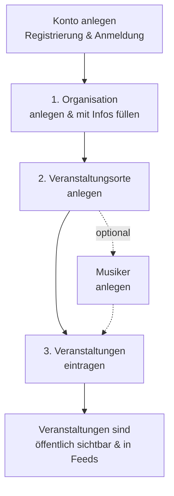

# Mitwirken als Benutzer:in

Schön, dass Du bei dansal mitmachen möchtest! 🧡

dansal lebt davon, dass Menschen wie Du die Veranstaltungen ihrer Tanzgemeinschaft eintragen und pflegen – egal, ob Du nur ab und zu einen einzelnen Termin ergänzt oder als Verein einen ganzen Kalender betreust. Diese Seite gibt Dir einen Überblick, was Du als Benutzer:in alles tun kannst, und führt Dich zu den passenden Schritt-für-Schritt-Anleitungen.

Für die meisten Funktionen brauchst Du ein Konto (kostenlos über die [Benutzer-Registrierung](Benutzer-Registrierung)) und eine Organisation, für die Du Veranstaltungen eintragen darfst. Organisationen werden in der Regel von einem Administrator angelegt oder bei der Registrierung beantragt.

## 🗺️ Empfohlener Einstieg für Neulinge

Der Aufbau folgt einer klaren Reihenfolge: **Zuerst** wird die Organisation mit ihren Informationen gefüllt, **dann** werden die Veranstaltungsorte angelegt – und **erst danach** trägst Du die Veranstaltungen ein. So kannst Du beim Eintragen auf bereits vorhandene Orte, Musiker und Vorlagen zurückgreifen und vermeidest doppelte Arbeit.

## 📚 Die einzelnen Funktionen

### Konto
- [Benutzer-Registrierung](Benutzer-Registrierung) – neues Konto anlegen und einer Organisation beitreten
- [Benutzer-Anmeldung](Benutzer-Anmeldung) – Anmeldung per Passkey, Passwort oder Magic Link, Passkeys auf weiteren Geräten einrichten

### Daten aufbauen
- [Benutzer-Organisationen](Benutzer-Organisationen) – Organisation mit Beschreibung, Links und Kontaktangaben füllen; Mitglieder, iCal-Feeds und Vorlagen verwalten
- [Benutzer-Veranstaltungsorte](Benutzer-Veranstaltungsorte) – Orte mit Adresse, Koordinaten und Eigenschaften (z. B. Parkplatz) anlegen; werden auf der Karte angezeigt
- [Benutzer-Veranstaltungen](Benutzer-Veranstaltungen) – Veranstaltungen eintragen und verwalten, von der einfachen Session bis zur Mehrtagesveranstaltung

### Ergänzende Inhalte & Werkzeuge
- [Benutzer-Musiker](Benutzer-Musiker) – Musiker- und Gruppenprofile anlegen und mit Veranstaltungen verknüpfen
- [Benutzer-Pflege](Benutzer-Pflege) – Veranstaltungen bearbeiten, absagen und über Orts- bzw. Organisationsansichten pflegen
- [Benutzer-Multi-Select](Benutzer-Multi-Select) – mehrere Einträge gleichzeitig bearbeiten
- [Benutzer-WordPress](Benutzer-WordPress) – Veranstaltungen direkt aus einer WordPress-Seite heraus pflegen

### Für Systemadministratoren
- [Benutzer-Administration](Benutzer-Administration) – Installation, Konfiguration und Betrieb einer dansal-Instanz

---

**Weiter zu**: [Registrierung](Benutzer-Registrierung) | [Veranstaltungen verwalten](Benutzer-Veranstaltungen)
