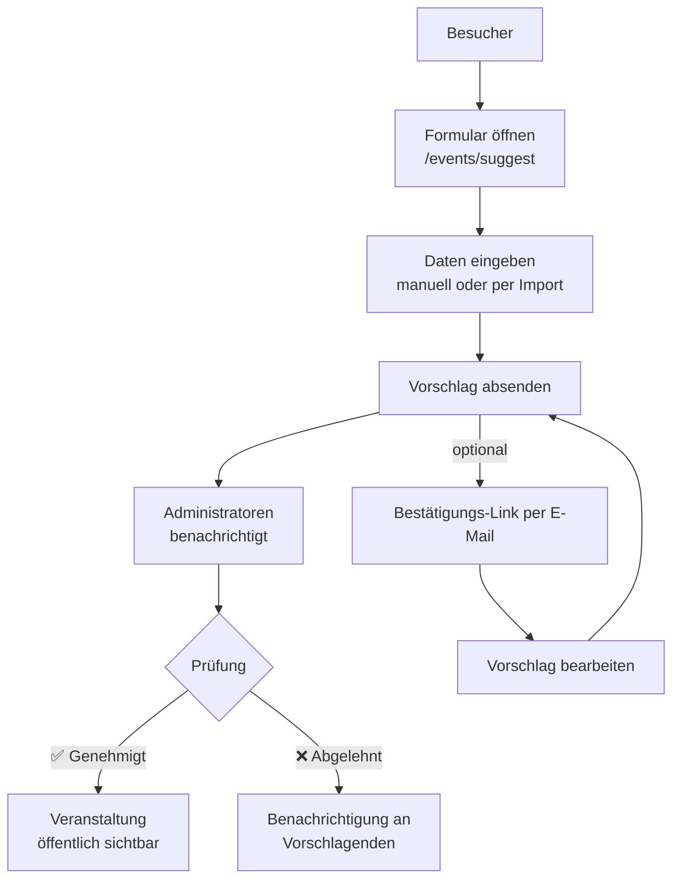

# Besucher-Guide – Tanzveranstaltungen finden

Willkommen bei dansal! Dieser Leitfaden hilft dir, Tanzveranstaltungen zu finden und mit der Community in Kontakt zu treten.

Deine Privatsphäre wird respektiert: Ohne dein Zutun werden keine persönlichen Daten über dich gespeichert. Cookies werden nur in bestimmten Fällen gesetzt – etwa wenn du die Anzeigesprache dauerhaft ändern möchtest oder eine Pinnwand-Sitzung speichern lässt – und dienen ausschließlich den Funktionen dieser Seite (siehe Abschnitt „Datenspeicherung" unten). Für manche Aktionen ist die Verifizierung einer E-Mail-Adresse oder eines Telegram-Kontos nötig, um Missbrauch zu vermeiden.

**Vorab:** Bitte kläre vorab, ob die Veranstaltung tatsächlich stattfindet. Diese Seite will die Veranstaltungen nur zentral vorstellen, wir sind nicht Veranstalter und kontrollieren auch nicht, ob Veranstaltungen durchgeführt werden.

## 🗺️ Veranstaltungen durchsuchen

### Interaktive Karte
- Die Startseite zeigt eine Karte mit kommenden Veranstaltungen
- Veranstaltungen werden als Pins angezeigt – anklicken für Details
- Mit dem Wochenkalender darunter kannst du den Zeitraum ändern
- Auf dem Smartphone: nach links/rechts wischen, um zwischen Wochen zu navigieren

### Veranstaltungsdetails
Jede Veranstaltungsseite kann folgende Infos enthalten:
- **Grunddaten**: Titel, Datum, Uhrzeit, Ort
- **Beschreibung**: Details, Ablauf, Preise
- **Veranstaltungsort**: Adresse, Barrierefreiheit, Parkplätze, Tanzboden-Infos
- **Veranstalter**: Kontaktinformationen und Social-Media-Links
- **Musiker**: Verlinkte Profile mit MusicBrainz-Links
- **Community-Pinnwand**: Fahrten, Unterkünfte, Tickets und Fundsachen
- **Anfahrt**: Kleine Karte und Link, um über Openstreetmap Fahrtrouten ermitteln zu lassen.

### Veranstaltungen filtern
- **Nach Datum**: Wochenkalender oder die Liste kommender Veranstaltungen nutzen
- **Nach Ort**: Karte zoomen/verschieben oder nach Stadt filtern. Auf der Suchseite (`/search`) schlägt das Feld **Ort** schon beim Tippen passende Orte vor – auch bei Tippfehlern („Magdeburh“ findet Magdeburg). Orte mit 🌐 haben (noch) keine Veranstaltungen; wählst du einen davon, zeigt die Suche Veranstaltungen im gewählten Umkreis. Findet sich nichts, drücke **Enter**, um den vollständigen Namen online nachschlagen zu lassen.
- **Nach Typ**: Filter nach Ball, Workshop, Festival usw.

## 🏛️ Organisationen entdecken

Auf der Seite „Organisationen“ (`/organizations`) findest du eine Übersicht aller Veranstalter – auch ohne Benutzerkonto:
- Eine Karte zeigt die Standorte aller Organisationen
- Jede Organisation wird als Karte mit Name, Ort, Kurzbeschreibung sowie der Anzahl an Veranstaltungen und Veranstaltungsorten angezeigt
- Anklicken einer Karte öffnet die Detailseite der Organisation mit Kontaktinformationen, Social-Media-/Fediverse-Links, allen zugehörigen Veranstaltungsorten und kommenden Veranstaltungen

## 🚗 Community-Pinnwand

Jede Veranstaltung hat eine Pinnwand für:
- **Fahrten**: Fahrten zur Veranstaltung anbieten oder suchen
- **Unterkunft**: Mitwohngelegenheiten oder Unterkünfte vor Ort finden
- **Tickets**: Tickets sicher kaufen/verkaufen
- **Fundsachen**: Nach der Veranstaltung verlorene Gegenstände melden oder Gefundenes anbieten

**So funktioniert's:**
1. Auf der Veranstaltungsseite „Auf Pinnwand posten“ anklicken
2. Kategorie wählen (Fahrten, Unterkunft, Tickets, Fundsachen)
3. Nachricht und Kontaktdaten eingeben
4. Per E-Mail oder Telegram verifizieren
5. Dein Beitrag erscheint nach der Verifizierung
6. Der Link in der E-Mail-Adresse kann auch verwendet werden, um den Eintrag wieder zu löschen oder zu ändern
7. Optional kannst du auf der Verwaltungsseite den Browser „merken" lassen – dann kannst du 30 Tage lang ohne erneute E-Mail-Bestätigung auf der Pinnwand posten. Die gespeicherte Sitzung lässt sich dort jederzeit wieder entfernen.

**So antwortest Du:**
1. Auf eine Nachricht "Antworten" klicken
2. Nachricht und Kontakt-Daten eingeben
3. Per E-Mail oder Telegram verifizieren
4. Die Nachricht mit Kontaktdaten werden erst jetzt weitergeleitet

## ➕ Veranstaltung vorschlagen

Auch ohne Benutzerkonto kannst du eine fehlende Veranstaltung vorschlagen, damit sie auf dansal erscheint.

**So funktioniert's:**
1. Über „Veranstaltung vorschlagen“ in der Navigation die Seite `/events/suggest` öffnen
2. Die Angaben für den sechsstufigen Formular-Assistenten eintragen – von Hand oder deutlich schneller per Kalenderimport, der die Felder automatisch füllt (siehe „📅 Kalenderimport als Abkürzung“)
3. Vorschlag absenden – die Administratoren werden direkt benachrichtigt und der Vorschlag ist sofort für sie zur Prüfung sichtbar, unabhängig von einer E-Mail-Bestätigung
4. Ist E-Mail-Versand eingerichtet, erhältst du zusätzlich einen Link per E-Mail, über den du den Vorschlag später jederzeit selbst einsehen oder bearbeiten kannst – ein Klick darauf ist aber keine Voraussetzung dafür, dass der Vorschlag bei den Administratoren ankommt
5. Ein Administrator prüft den Vorschlag und veröffentlicht ihn – bis dahin ist die Veranstaltung **nicht öffentlich sichtbar**

**📝 Die Formularfelder (Schritt für Schritt)**
- **Was:** Titel sowie Art/Tags (Ball, Workshop, Festival, Open-Air, Session, Konzert …) und bei Workshops das Niveau (Anfänger/Mittel/Fortgeschritten); dazu Tänze sowie Musikerinnen/Musiker und Kursleiterinnen/Kursleiter – Namen werden beim Tippen aus der Suche vorgeschlagen
- **Wann:** Datum, Start- und Endzeit sowie der Eintrittspreis (frei, Spende, fester Betrag oder gestaffelte Preistabelle). Das **Datum** lässt sich wahlweise direkt ins Textfeld eintippen (z. B. `DD.MM.YYYY`) **oder** per Klick auf den Kalender-Button (Datepicker) auswählen – beides funktioniert
- **Wo:** Veranstaltungsort. Ein Suchfeld schlägt bereits bekannte Orte und OpenStreetMap-Orte vor; ist der Ort noch nicht erfasst, werden Name, Straße, PLZ, Ort und Land eingegeben
- **Beschreibung:** Beschreibungstext, Link zur Original-Veranstaltungsseite sowie Speisen/Getränke
- **Ablaufplan:** optional ein Zeitplan mit Programmpunkten (Beginn/Ende, Titel, Raum, Art, Beschreibung)
- **Kontakt:** Name und E-Mail-Adresse; ein Bild kann nach der Verifizierung über den Verwaltungslink nachträglich hochgeladen werden

**📅 Kalenderimport als Abkürzung**
- Statt alles von Hand einzutippen: im Assistenten auf den Reiter **Import** wechseln und eine `.ics`-Datei aus deinem Kalenderprogramm (z. B. vom Veranstaltungsort oder -verein) oder eine passende `.json`-Datei per Drag & Drop hochladen – oder eine Kalender-URL einfügen, z. B. `https://beispiel.de/kalender.ics`
- Die Datei wird eingelesen und in eine Vorschau übernommen: Enthält sie mehrere Termine, wählst du den gewünschten in der Auswahlliste aus („Verwenden“). Titel, Datum/Uhrzeit, Ort und Beschreibung des Termins füllen damit automatisch die passenden Felder des Assistenten
- Die übernommenen Werte sind eine Vorlage: Jeder Schritt kann im Assistenten weiter geprüft und von Hand korrigiert werden, bevor du absendest

**Hinweise:**
- Die Funktion ist nur verfügbar, wenn die Instanz E-Mail- oder Telegram-Benachrichtigungen konfiguriert hat – ist beides nicht eingerichtet, ist die Seite nicht erreichbar
- Zum Schutz vor Spam gibt es ein Rate-Limit pro IP-Adresse sowie automatische Bot-Erkennung
- Eine angegebene E-Mail-Adresse wird nur zur Verifizierung verwendet (siehe Abschnitt „Datenspeicherung“ unten)

## 🔄 Feed vorschlagen

Kennst du einen Verein oder eine Location mit eigenem Veranstaltungskalender (iCal- oder JSON-Feed), der noch nicht auf dansal erscheint? Auch das lässt sich ganz ohne Benutzerkonto vorschlagen – anders als beim einzelnen Veranstaltungsvorschlag oben wird hier ein **ganzer, dauerhaft automatisch aktualisierter Feed** angemeldet.

**So funktioniert's:**
1. Über „Feed vorschlagen“ die Seite `/feeds/suggest` öffnen
2. E-Mail-Adresse angeben und entweder eine bestehende Organisation auswählen oder eine neue vorschlagen
3. Feed-URL eingeben – eine Vorschau prüft, ob sich der Feed einlesen lässt und zeigt die enthaltenen Veranstaltungen
4. Enthaltene Ortsangaben einzeln einem bestehenden Ort zuordnen oder mit Adresse/Ort für einen neuen Ort ergänzen
5. Vorschlag absenden – auch hier landet er sofort bei den Administratoren (bzw. bei bereits aktiven Mitgliedern der gewählten Organisation) zur Prüfung
6. Bei Genehmigung wird die Organisation/der Ort bei Bedarf angelegt und die Veranstaltungen sofort erstmalig abgerufen

Auf der Bestätigungsseite und per E-Mail wird direkt ein Link angeboten, um ein Konto einzurichten und die Organisation bzw. den Feed künftig selbst zu verwalten.

**Nur eine einzelne Veranstaltungsseite statt eines ganzen Feeds?** Beim Feld „Typ“ lässt sich statt der automatischen Erkennung auch „Event-Seite (JSON-LD)“ auswählen. Damit lässt sich die URL einer einzelnen Veranstaltungsseite vorschlagen, die ihre Angaben in strukturierten Daten (schema.org, wie sie z. B. WordPress-Eventkalender-Plugins oder viele Ticketing-Anbieter automatisch einbetten) veröffentlicht – auch ohne eigenen iCal- oder JSON-Feed. Da es sich um eine einzelne Seite statt eines dauerhaften Feeds handelt, wird sie nur einmalig abgerufen, nicht laufend aktualisiert.

**Hinweise:** wie beim Veranstaltungsvorschlag ist die Funktion nur verfügbar, wenn die Instanz E-Mail- oder Telegram-Benachrichtigungen konfiguriert hat, und ebenso mehrschichtig gegen Missbrauch abgesichert (Rate-Limit, Bot-Erkennung).

## 🌍 Mehrsprachigkeit

dansal unterstützt 12 Sprachen. Sprache ändern über:
- Sprachauswahl in der Navigationsleiste (wird in einem Cookie gespeichert)
- Automatische Erkennung der Browsersprache (für neue Besucher)

## 📱 Mobile Nutzung

dansal ist vollständig responsiv:
- **Wischgesten**: Wochen per Wischen navigieren
- **Touch-freundlich**: Große Schaltflächen und Bedienelemente
- **Dunkelmodus**: Automatisch oder manuell umschaltbar

## Datenspeicherung
### Cookies
Cookies werden nur gesetzt, wenn eine Sprache dauerhaft gespeichert werden soll oder einzelne Funktionen eine temporäre Sitzung benötigen (z. B. eine angefangene Registrierung, eine bestätigte Pinnwand-Sitzung oder ein Anmeldevorgang über einen externen Anbieter). Sie dienen ausschließlich diesen Funktionen – eine Nachverfolgung über Websites hinweg findet nicht statt.

Beim Ändern der Sprache kommt eine Abfrage, ob die Auswahl dauerhaft (per Cookie) gespeichert werden soll. Wird dies verweigert, wird die Auswahl verworfen und die Sprache nicht gespeichert – auch nicht für die laufende Sitzung. Bei der nächsten Sitzung wird dann wieder die Sprache dargestellt, die der Browser anfragt.

### E-Mail-Adresse zur Verifizierung
Für einzelne Aktionen wird eine Verifizierung verlangt. Dazu wird an eine E-Mail-Adresse ein Link geschickt, um die Aktion zu bestätigen. Mit Verifizierung wird die E-Mail-Adresse sofort gelöscht (Ausnahme Pinnwand).

Wird die Verifizierung nicht innerhalb eines bestimmten Zeitraums durchgeführt, wird die Aktion mitsamt der Kontakt-Daten gelöscht

### Kontakt-Daten für Pinnwand
Um Nachrichten auf die Pinnwand zu setzen, werden Kontaktdaten erwartet. Neben einem Namen auch E-Mail-Adresse. Beides müssen nicht Realnamen sein, sondern gerne Bezeichnungen, unter denen ihr in der Szene bekannt seid. Die E-Mail-Adresse wird nicht öffentlich dargestellt, sondern nur gespeichert, um Antworten weiterleiten zu können. Wer den Browser nach der Verifizierung „merken" lässt, erhält eine auf 30 Tage begrenzte Sitzung mit der verifizierten Adresse; sie lässt sich jederzeit über die Verwaltungsseite entfernen.

### IP-Adressen
Es gibt einige Situationen, in denen IP-Adressen zum Schutz vor Missbrauch verarbeitet werden: Bei auffälligen Anfragen (zu viele Anfragen von einer IP-Adresse oder ein Bot, der versteckte Formularfelder ausfüllt) wird die IP-Adresse vorübergehend erfasst und der Zugriff gedrosselt; nach zu vielen Anfragen blockiert die Firewall die IP-Adresse zeitweise. In allen übrigen Logs wird von IP-Adressen nur ein gekürzter Prüfwert (Hash) gespeichert, aus dem sich die Adresse nicht rekonstruieren lässt.

## 📄 Nutzungsbedingungen & Datenschutz

- Die **Nutzungsbedingungen** findest du unter `/terms` und die **Datenschutzerklärung** unter `/privacy` – außerdem das **Impressum** unter `/impressum` (sofern die Instanz diese Seiten eingerichtet hat). Alle drei sind auf jeder Seite unten in der Fußzeile verlinkt (Hilfe · Datenschutz · Nutzungsbedingungen · Impressum).
- Der Abschnitt „Datenspeicherung“ oben fasst die wichtigsten Punkte im Überblick zusammen; im Detail gilt die Datenschutzerklärung der jeweiligen Instanz.

## 🛟 Hilfe & Probleme melden

- **Fragen & Hilfe:** über den Hilfe-Link (`/help`) in der Fußzeile sowie über die Kontaktinformationen im Impressum bzw. in der Fußzeile. Zu einer bestimmten Veranstaltung wende dich direkt an die dort genannten Veranstalter.
- **Fehler (technische Probleme):** melde sie im [Issue-Tracker auf GitHub](https://github.com/ademant/dansal/issues). Manche Fehlermeldungen enthalten eine kurze Fehler-Kennung (`error_id`) – gib sie bei der Meldung mit an, damit das Team den Fehler im Protokoll wiederfindet.
- **Copyright-Verletzungen oder illegale Inhalte:** melde den betroffenen Inhalt direkt an den Betreiber dieser Seite – die Kontaktadresse steht im Impressum (`/impressum`) bzw. in der Fußzeile. Bitte beschreibe, welcher Inhalt betroffen ist und warum er entfernt werden sollte; nach Prüfung wird er entfernt.

**Möchtest Du mithelfen?** Kontaktiere den Betreiber dieser Seite oder beteilige dich am [Quellcode auf GitHub](https://github.com/ademant/dansal).
